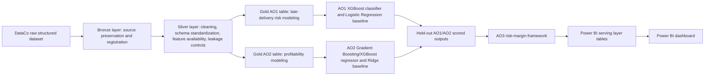
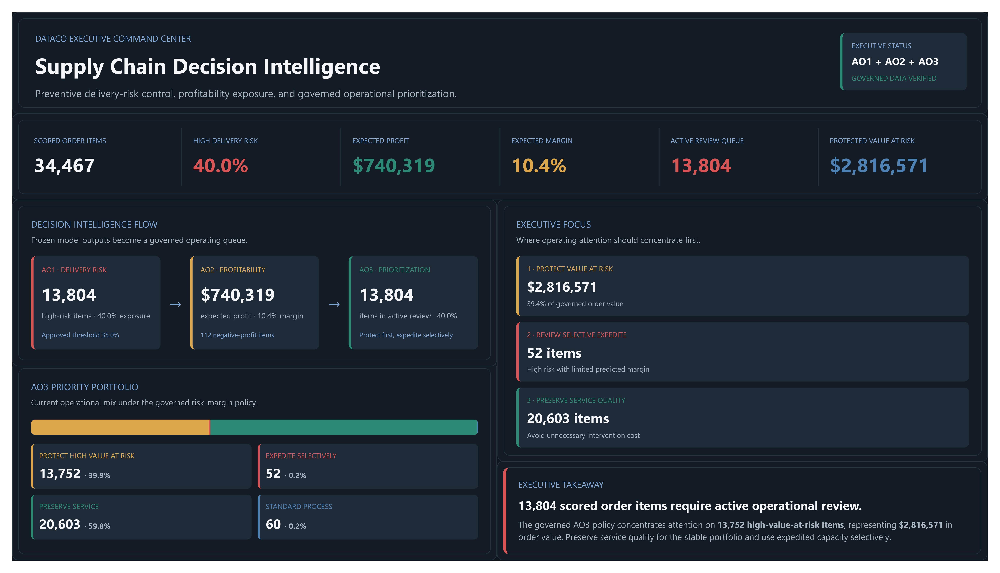

# Predicting Late Delivery Risk and Explaining Order Profitability in a Global E-Commerce Supply Chain

DAMO 699 Capstone Final Report Final Markdown

Team: Group 2

Institution: University of Niagara Falls Canada

Instructor: Prof William Pourmajidi, PhD

Date: 03-Jun-2026

## Abstract / Executive Summary

This capstone develops a pre-shipment decision-support framework for global e-commerce supply chain operations using the DataCo Smart Supply Chain dataset. The business problem is that managers need to identify which orders deserve attention before dispatch, when intervention is still possible. Late-delivery risk alone is not sufficient for this decision because the value of intervention also depends on expected order profitability. The project therefore combines late-delivery risk prediction, expected profitability estimation, and risk-margin prioritization into one analytical workflow.

The research question is: How can pre-shipment attributes available at order creation be used to build a practical pre-dispatch order-prioritization framework that combines late-delivery risk and expected order profitability in a global e-commerce supply chain?

The analysis is organized around three analytical objectives. AO1 predicts late-delivery risk using pre-shipment and order-time attributes. AO2 estimates expected order-level profitability before dispatch. AO3 combines the AO1 and AO2 outputs into a risk-margin segmentation framework that supports differentiated operational review. The final visualization layer is a Power BI dashboard connected to governed Azure Databricks serving-layer tables.

The evidence supports the project hypotheses with appropriate caveats. H1 is supported on chronological validation evidence because the AO1 XGBoost classifier outperformed Logistic Regression on ROC-AUC and recall, along with the other checked validation metrics. H2 is supported on chronological validation evidence with modest improvement because the AO2 Gradient Boosting/XGBoost Regressor improved RMSE and MAE relative to Ridge Regression, although R-squared remained low and the target-reconstruction audit accepted the model with caution. H3 is supported by held-out scored prediction outputs and AO3 benchmark segmentation because the combined risk-margin framework identified operational groups that were not fully evident from either risk-only or margin-only views.

The report does not claim causal intervention impact, production deployment, or unsupported final-test confirmation. The results should be interpreted as an academic decision-support prototype with documented leakage controls, chronological validation discipline, model-explanation caveats, and final dashboard evidence provided through the Power BI export package.

## Introduction and Business Problem

Late delivery is a recurring operational issue in e-commerce supply chains because customer promises, shipping mode, product mix, geography, order timing, and fulfillment constraints interact before the customer receives the order. Once an order has already shipped or a delivery failure has already occurred, the opportunity for preventive action is limited. A useful managerial system should therefore focus on the period when the order has been created and planned but has not yet moved beyond the pre-dispatch decision window.

This project frames the DataCo capstone as a pre-shipment prioritization problem. The objective is not only to describe historical late deliveries or realized profit. The objective is to estimate early risk and expected profitability signals that can guide operational triage before dispatch. This framing drives the project's methodological controls: features must be available at order creation or before shipment, and post-outcome variables must not be used as predictors.

The business problem also requires combining two signals. A risk-only ranking can identify orders likely to arrive late, but it does not distinguish between valuable at-risk orders and weak-margin at-risk orders. A profit-only ranking can identify orders with stronger expected economics, but it does not show which of those orders are most exposed to service failure. The AO3 risk-margin framework addresses this gap by combining the AO1 predicted late-delivery probability with AO2 predicted profitability and derived predicted margin.

The intended output is a practical decision-support framework. Orders with high predicted delivery risk and positive predicted margin can be placed in a protection queue. Orders with high predicted delivery risk and weak or negative predicted margin can be reviewed selectively before expensive intervention. Lower-risk high-margin orders can receive service-preservation attention, and lower-risk low-margin orders can remain under standard process with margin monitoring. These recommendations are triage guidance only; they do not prove that any intervention will improve realized delivery or profit outcomes.

## Research Question, Objectives, and Hypotheses

The capstone research question is:

> How can pre-shipment attributes available at order creation be used to build a practical pre-dispatch order-prioritization framework that combines late-delivery risk and expected order profitability in a global e-commerce supply chain?

The research question is both operational and methodological. Operationally, it asks how managers can prioritize orders before dispatch. Methodologically, it asks how to create that prioritization while avoiding variables that would not be available at the decision time.

The analytical objectives are:

1. AO1: Predict late-delivery risk using pre-shipment and order-time attributes.
2. AO2: Estimate expected order-level profitability before dispatch.
3. AO3: Combine AO1 and AO2 outputs into a risk-margin prioritization framework.
4. Dashboard layer: Communicate the analytical results through Power BI using governed Azure Databricks serving-layer tables.

The hypotheses are:

**H1.** For late-delivery prediction, an XGBoost classifier will outperform logistic regression on held-out data, particularly in AUC-ROC and recall.

**H2.** For order-profitability estimation, a gradient boosting regressor will outperform linear or ridge regression on held-out data, particularly in RMSE and MAE.

**H3.** Combining predicted late-delivery risk and expected order profitability in a risk-margin framework will identify pre-dispatch priority groups that are not evident from either signal alone and therefore support differentiated operational actions.

The hypotheses are integrated. AO1 and AO2 produce the two prediction signals required for AO3. AO3 then turns those signals into operational segments. Power BI is the communication layer for reviewing the model evidence, segment outputs, and governance context.

| Objective | Primary question | Main output | Role in framework |
| --- | --- | --- | --- |
| AO1 | Which orders are likely to arrive late? | Predicted late-delivery probability and high-risk flag | Risk signal for AO3 |
| AO2 | Which orders are expected to be profitable or loss-making? | Predicted order profit and derived predicted margin | Margin signal for AO3 |
| AO3 | Which orders deserve differentiated pre-dispatch review? | Risk-margin priority segment | Decision-support layer |
| Power BI | How can reviewers inspect and use the results? | Dashboard connected to Databricks serving tables | Communication layer |

## Literature Review / Analytical Context

Supply-chain analytics research provides the broader context for this project because the practical value of prediction depends on its connection to an operational decision. AI and machine-learning reviews in supply-chain management describe prediction, risk identification, logistics planning, and performance improvement as recurring supply-chain analytics use cases (Toorajipour et al., 2021; Ni et al., 2020). This capstone narrows that broad literature context to a specific pre-dispatch prioritization problem.

Delivery-risk prediction is the first analytical requirement. Supply-chain risk-prediction literature supports using machine learning to identify operational risk patterns while recognizing the trade-off between performance and interpretability (Baryannis et al., 2019). Applied supply-chain forecasting work also provides context for interpretable model use with SHAP (Ahmed et al., 2025). The hypothesis evidence in this report, however, comes from the project's checked-in validation artifacts rather than from external literature.

Profitability estimation is a regression task. General statistical learning references support the use of linear baselines, regularized regression, and nonlinear boosting methods for supervised prediction (Hastie et al., 2009). In this project, Ridge Regression provides the AO2 baseline and Gradient Boosting/XGBoost regression provides the primary nonlinear profitability model. Profitability modeling also creates a methodological risk: commercial fields may approximate accounting formulas. The report therefore treats AO2 as expected profitability estimation, not as profit reconstruction.

Leakage-safe modeling is central to the validity of the project. Liu et al. (2022) support the general risk that future or test information can create leakage and falsely high evaluation results. This source is time-series-focused rather than supply-chain-specific, so the report uses it only for the general temporal-leakage principle. Project-specific controls are documented through the feature availability policy, leakage-control plan, chronological split policy, and AO2 target-reconstruction audit.

Explainability is included because the project must support academic review and managerial interpretation. SHAP summaries are used to describe model-driver patterns for AO1 and AO2. SHAP is interpreted as model explanation rather than causal evidence, consistent with its use as a model-interpretation method rather than an intervention-impact method (Lundberg & Lee, 2017).

AO3 uses segmentation to convert prediction signals into operational groups. The project uses a governed 2x2 risk-margin framework rather than promoting unsupervised clustering as the main decision layer. The optional K-means extension was evaluated but not adopted because the artifacts concluded that the clusters mostly duplicated the clearer risk-margin matrix.

The dashboard layer is a business-intelligence communication layer. Microsoft Learn documents Power BI with Azure Databricks as the official connector source for the selected Power BI-to-Azure-Databricks architecture (Microsoft, 2026a).

## Data Source and Data Governance

The primary dataset is the DataCo Smart Supply Chain for Big Data Analysis dataset from Mendeley Data, version 5 (Constante et al., 2019). The checked source verification evidence records DOI `10.17632/8gx2fvg2k6.5`, publication date March 12, 2019, and CC BY 4.0 licensing.

The verified structured dataset contains 180,519 rows and 53 columns. The companion metadata file contains 52 metadata rows. The raw structured file was parsed with `latin-1` encoding and comma delimiters. The dataset contains order, customer, product, shipping, logistics, geography, and financial fields.

### Table 1. DataCo Dataset Summary

Source artifacts: `docs/data_source_verification.md`, `docs/medallion_structure.md`, `report/final_report_assets/tables/table_1_dataco_dataset_summary.md`.

| Field | Value | Final report note |
| --- | --- | --- |
| Dataset name | DataCo SMART SUPPLY CHAIN FOR BIG DATA ANALYSIS | Primary structured dataset for the capstone. |
| Source | Mendeley Data, Version 5 | Official URL recorded as `https://data.mendeley.com/datasets/8gx2fvg2k6/5`. |
| DOI | `10.17632/8gx2fvg2k6.5` | Use the DOI in final References. |
| Published date | 2019-03-12 | Dataset source date. |
| Contributors | Fabian Constante; Fernando Silva; Antonio Pereira | Dataset contributor names from source verification. |
| License | CC BY 4.0 | Public academic use with attribution. |
| Main structured file | `DataCoSupplyChainDataset.csv` | Structured transactional supply-chain dataset. |
| Companion metadata file | `DescriptionDataCoSupplyChain.csv` | Used for source metadata and data dictionary review. |
| Data rows | 180,519 | Verified parsed row count. |
| Dataset columns | 53 | Verified parsed column count. |
| Companion metadata rows | 52 | Metadata row count from companion file. |
| Data domain | Order, customer, product, shipping, logistics, geography, and financial fields | Supports AO1, AO2, and AO3. |
| Project use | Pre-shipment late-delivery risk prediction, profitability estimation, and AO3 risk-margin prioritization | Structured clickstream file is out of scope unless project scope changes. |
| Governance notes | Raw source files are preserved without manual changes; cleaning and modeling controls are handled through Silver, Gold, and documented policies | Supports reproducible Bronze-Silver-Gold workflow. |
| Main dataset SHA-256 verification | Passed; official checksum `fa6d022ed437155e1a2f0378710602848703c8a7f203f7ff5d77805bf8480aa6` | Checksum/source verification evidence. |
| Metadata file SHA-256 verification | Passed; official checksum `9828e34669bd6d77e3b4463364cc44a5d52446b5e246fc258758cfe592566c4b` | Checksum/source verification evidence. |
| Known limitations | Public academic dataset; final report treats the project as an academic decision-support prototype, not a validated production operating system | Limits generalization to live enterprise operations. |

Important modeling fields include `Late_delivery_risk`, `Order Profit Per Order`, planned shipping fields, order dates, market, region, country, category, discount rate, quantity, and price-related fields. Not all fields are valid predictors. Some are targets, target proxies, post-shipment outcomes, duplicate outcomes, or identifiers that are unsuitable for modeling.

Source verification also identified data-quality considerations. The metadata file matched 51 of 53 dataset columns exactly after trimming. `Order Zipcode` and `shipping date (DateOrders)` did not match the metadata exactly after trimming. Blank-value checks found complete blankness in `Product Description`, high blankness in `Order Zipcode`, and a small number of blanks in customer-name and zipcode fields. These issues do not block ingestion, but they support the need for documented schema and cleaning rules.

The DataCo dataset is public, anonymized, and partially synthetic. That status makes it suitable for academic analysis but limits generalization to a live enterprise setting. The report therefore positions the work as a reproducible academic decision-support prototype, not as a validated production operating system.

Data governance follows a Medallion structure. Bronze preserves raw source data and source metadata. Silver applies cleaning, type standardization, lineage fields, and feature availability documentation. Gold contains objective-specific analytical tables, model outputs, AO3 segment outputs, and dashboard-serving outputs. This structure keeps raw source data unchanged while making downstream analysis reproducible.

## Data Engineering and Cloud Implementation

The project uses a Bronze-Silver-Gold architecture to move from raw DataCo files to analytical and dashboard-ready outputs. Bronze preserves the source data. Silver provides cleaned and standardized analytical tables. Gold contains model-ready tables, validation outputs, held-out scoring outputs, AO3 segment assignments, and dashboard-serving artifacts.

### Figure 1. Medallion and Project Workflow Architecture

Source artifacts: `docs/medallion_structure.md`, `docs/project_orchestrator.md`, `report/final_report_assets/figures/figure_1_medallion_project_workflow.md`.



Caption: Figure 1 shows the workflow from DataCo source data through Bronze, Silver, Gold, AO1/AO2 modeling, AO3 risk-margin prioritization, and the Power BI serving layer.

Source note: Mermaid source is maintained in `report/final_report_assets/figures/figure_1_medallion_project_workflow.md`. No PNG was generated in this repository package.

Databricks Community Edition is the standard execution environment for the project. The documented preferred runtime is Databricks Runtime 14.3 LTS with Spark 3.5.0, with 13.3 LTS as a fallback. Spark and Delta support the data-processing and table-management pattern used in the academic workflow (Zaharia et al., 2016; Armbrust et al., 2020). Microsoft Learn provides the external platform context for Azure Databricks (Microsoft, 2026b).

Reusable logic lives in the repository's source modules, while notebooks and workflow scripts orchestrate execution. The workflow coordinates setup validation, source validation, Bronze ingestion, Silver cleaning, feature engineering, Gold table creation, chronological partitioning, model training, evaluation, explainability, AO2 target-reconstruction audit, AO1 threshold selection, held-out AO1/AO2 scoring, AO3 segmentation, AO3 benchmarking, optional K-means review, and Power BI serving-layer registration.

Many generation steps are disabled by default in final packaging workflows so that model artifacts and dashboard artifacts are not regenerated accidentally. This final report source uses checked-in result artifacts as evidence and does not rerun data engineering, model training, evaluation, export generation, or dashboard creation.

## Leakage-Control and Chronological Split Methodology

The project is governed by a decision-time integrity rule: a feature may be used for modeling only if it is known at order creation or can be derived from information available before shipment. This rule protects the project's pre-shipment framing and prevents models from using information that would only be known after fulfillment or delivery.

AO1 forbidden predictors include the target `Late_delivery_risk`, delivery status, actual shipping duration, shipping completion timestamps, order status, and other post-outcome or target-proxy fields. AO2 forbidden predictors include `Order Profit Per Order`, duplicate profit fields, profit ratios, realized margin-like fields, and direct transformations of profit. Non-operational identifiers and empty fields are also excluded from modeling.

The split strategy is chronological rather than random. The split anchor is `order_date_DateOrders`, representing order creation time. Rows are sorted by order date, order identifier, and order-item identifier. The earliest 80% become the development set, and the most recent 20% become the final held-out test set. This rule is applied separately to each objective-specific Gold table after its population policy is applied.

### Table 2. Chronological Split Summary

Source artifacts: `docs/chronological_split_policy.md`, `data/references/ao1_chronological_partition_summary.csv`, `data/references/ao2_chronological_partition_summary.csv`.

| Objective | Partition | Row count | Share | Date range | Role in modeling | Held-out usage caveat |
| --- | --- | ---: | ---: | --- | --- | --- |
| AO1 late-delivery risk | Overall | 172,765 | 1.0000 | 2015-01-01 to 2018-01-31 | Full AO1 Gold population after population policy | Overall row set only; not a model-selection slice. |
| AO1 late-delivery risk | Development | 138,212 | 0.8000 | 2015-01-01 to 2017-04-22 | Development partition; inner validation evidence is drawn from development artifacts | Final test remains untouched for AO1 model selection and H1 validation wording. |
| AO1 late-delivery risk | Test | 34,553 | 0.2000 | 2017-04-22 to 2018-01-31 | Reserved final held-out partition | Do not claim AO1 final-test confirmation unless a separate final-test artifact supports it. |
| AO2 profitability estimation | Overall | 180,519 | 1.0000 | 2015-01-01 to 2018-01-31 | Full AO2 Gold population after population policy | Overall row set only; not a model-selection slice. |
| AO2 profitability estimation | Development | 144,415 | 0.7999988921 | 2015-01-01 to 2017-04-22 | Development partition; H2 validation evidence is drawn from development artifacts | Final test remains untouched for AO2 model selection and H2 validation wording. |
| AO2 profitability estimation | Test | 36,104 | 0.2000011079 | 2017-04-22 to 2018-01-31 | Reserved final held-out partition | Do not claim AO2 final-test confirmation unless a separate final-test artifact supports it. |

Leakage-control note: rows are ordered chronologically by `order_date_DateOrders`, `Order_Id`, and `Order_Item_Id` before partitioning. The split is designed to prevent future records from informing earlier-period model selection.

AO1 has 172,765 Gold rows after its population policy, with 138,212 development rows and 34,553 test rows. AO2 has 180,519 Gold rows, with 144,415 development rows and 36,104 test rows. AO1 and AO2 validation claims use inner chronological validation slices inside the development partitions. The final test partitions are not used for AO1 or AO2 model-selection conclusions in the checked-in result documents.

All learned preprocessing is fit only on training data and then applied unchanged to validation or test data. This includes imputers, encoders, scalers, feature selectors, resampling, threshold selection, and hyperparameter tuning. The current AO1 workflow does not use a class-resampling method that requires an additional external method citation.

AO2 receives an additional target-reconstruction audit because financial predictors can be close to accounting formulas. The audit found zero forbidden features, confirmed that `ao3_order_value` was not detected as an AO2 predictor or dominant driver, and issued the final decision `accepted_with_caution`. This supports reporting AO2 as defensible expected-profitability estimation while preserving caution around approved commercial predictors.

## Analytical Methods

The project uses multiple supervised and decision-support methods. Logistic Regression provides the AO1 baseline classifier. XGBoost classification provides the primary nonlinear AO1 model. Ridge Regression provides the AO2 regularized linear baseline. Gradient Boosting/XGBoost regression provides the primary nonlinear AO2 profitability model. SHAP supports model-driver explanation for AO1 and AO2. AO3 applies a rule-based risk-margin segmentation policy. K-means was reviewed as an optional extension but was not adopted.

For AO1, the target is `Late_delivery_risk`, where `1` indicates a historical late-delivery event. The selected XGBoost candidate is `deeper_conservative`, chosen from a validation-only candidate set using ROC-AUC as the primary metric and recall as the secondary metric. The final report cites the official XGBoost documentation for implementation support (xgboost developers, 2026).

For AO2, the target is `Order_Profit_Per_Order`. Ridge Regression is the baseline, and Gradient Boosting/XGBoost regression is the primary nonlinear model. Ridge implementation support is cited through the scikit-learn Ridge documentation because the report discusses Ridge as the AO2 baseline (scikit-learn developers, n.d.).

SHAP is used for model explanation and leakage review. The AO1 SHAP artifacts highlight planned shipping service, scheduled service windows, order timing, and geography. The AO2 SHAP artifacts highlight commercial, geography, product, discount, and quantity signals with target-policy caution. These patterns are model associations, not causal effects.

AO3 applies fixed thresholds to held-out AO1/AO2 score outputs. Orders with predicted late-delivery probability greater than or equal to 0.35 are high risk. Orders with predicted margin greater than or equal to 0.0 are high margin. The resulting segments are used for operational interpretation rather than model training.

## AO1 Results: Late-Delivery Risk Prediction

AO1 evaluates whether late-delivery risk can be predicted before dispatch. The validation evidence uses the shared chronological validation slice inside the development partition. The final test partition is reserved and is not used for AO1 model selection, threshold selection, SHAP explainability, or H1 validation in the current result documentation.

The AO1 inner training slice contains 110,569 rows, the validation slice contains 27,643 rows, and the final test partition contains 34,553 reserved rows.

### Table 3. AO1 Model Validation Comparison

Source artifacts: `report/tables/ao1_model_validation_comparison.csv`, `docs/ao1_results_h1_validation.md`.

| Model | ROC-AUC | PR-AUC | Accuracy | Precision | Recall | F1 | Log loss | Conclusion |
| --- | ---: | ---: | ---: | ---: | ---: | ---: | ---: | --- |
| XGBoost classifier | 0.7752787090098937 | 0.8489117912727454 | 0.7212314148247296 | 0.8890176760359316 | 0.5839730981536705 | 0.7049092440836333 | 0.5132764633696615 | Primary model. |
| Logistic Regression baseline | 0.7425530885785165 | 0.8306652164503137 | 0.6855623485149948 | 0.8295571095571096 | 0.5644946386650593 | 0.671826625386997 | 0.572337054661078 | Baseline comparator. |

H1 interpretation: XGBoost outperformed Logistic Regression on the chronological validation slice, including ROC-AUC and recall. H1 is supported on validation evidence.

Caveat: this table does not claim final-test confirmation. The final test partition remains reserved unless a separate checked artifact supports final-test wording.

The XGBoost classifier outperformed Logistic Regression on the shared validation slice. XGBoost achieved ROC-AUC 0.7753, PR-AUC 0.8489, accuracy 0.7212, precision 0.8890, recall 0.5840, F1 0.7049, and log loss 0.5133 at threshold 0.50. Logistic Regression achieved ROC-AUC 0.7426, PR-AUC 0.8307, accuracy 0.6856, precision 0.8296, recall 0.5645, F1 0.6718, and log loss 0.5723. XGBoost improved ROC-AUC by 0.0327 and recall by 0.0195 at the default threshold.

The AO1 operating threshold for AO3 is 0.35 rather than the default 0.50. The threshold policy prioritizes recall while keeping the predicted positive rate operationally manageable. At threshold 0.35, validation precision is 0.8469, recall is 0.6171, predicted positive rate is 0.4154, false negatives are 6,035, and false positives are 1,758.

AO1 SHAP results support interpretation and leakage review. The strongest driver is First Class shipping mode, followed by scheduled service-window and geography features. These patterns are plausible because they relate to planned service promises and order context, but they should not be interpreted causally. The post-model leakage audit found no reviewed driver resembling the AO1 target, actual shipping duration, delivery status, shipping completion status, realized profit, final-test labels, or another direct post-outcome proxy.

H1 is supported on chronological validation evidence. The report should not state that H1 is confirmed on the final test partition unless a separate final-test artifact supports that wording.

## AO2 Results: Profitability Estimation

AO2 estimates expected order-level profitability before dispatch. The target is `Order_Profit_Per_Order`. The output should be interpreted as expected profitability, not as guaranteed known profit at dispatch time and not as direct accounting reconstruction.

The AO2 inner training slice contains 115,532 rows, the validation slice contains 28,883 rows, and the final test partition contains 36,104 reserved rows. H2 statements are based on the validation slice only.

### Table 4. AO2 Model Validation Comparison

Source artifacts: `report/tables/ao2_model_validation_comparison.csv`, `report/tables/ao2_results_h2_summary.csv`, `docs/ao2_results_h2.md`.

| Model | Model type | RMSE | MAE | R-squared | Median absolute error | Mean error | Conclusion |
| --- | --- | ---: | ---: | ---: | ---: | ---: | --- |
| Gradient Boosting / XGBoost Regressor | `xgboost.XGBRegressor` | 95.62030998471721 | 52.646255065500654 | 0.011785892044576474 | 31.395399094682617 | 0.9627362709037213 | Primary nonlinear model improved RMSE and MAE over Ridge. |
| Ridge Regression baseline | `sklearn.linear_model.Ridge` | 96.8276235490268 | 54.21910781630418 | -0.0133262689653563 | 32.55914083289695 | 0.6453064001768685 | Baseline comparator. |

H2 interpretation: H2 is supported on chronological validation evidence with modest support.

Caveat: final-test performance is not claimed. Residual errors remain large, predictions are compressed toward the mean, and the AO2 target-reconstruction decision remains `accepted_with_caution`.

The Gradient Boosting/XGBoost Regressor improved the primary AO2 metrics relative to Ridge. Gradient Boosting achieved RMSE 95.6203, MAE 52.6463, R-squared 0.0118, median absolute error 31.3954, and mean error 0.9627. Ridge achieved RMSE 96.8276, MAE 54.2191, R-squared -0.0133, median absolute error 32.5591, and mean error 0.6453. The improvement is 1.2073 lower RMSE, 1.5729 lower MAE, and 0.0251 higher R-squared.

The support for H2 is modest. R-squared remains low, and both models compress predictions toward the mean. The validation target standard deviation is 96.1905, while the prediction standard deviation is 19.5479 for Ridge and 11.9159 for Gradient Boosting. The wrong profit-sign share improved from 0.2536 for Ridge to 0.1974 for Gradient Boosting, which matters because profit-sign errors can affect AO3 high-margin or low-margin assignment.

AO2 SHAP results identify commercial, geography, product, discount, and quantity signals as model drivers. These signals are useful for interpretation but carry target-policy caution because approved commercial predictors can still be close to profitability calculation context. The target-reconstruction audit found zero forbidden features and issued the final decision `accepted_with_caution`.

H2 is supported on chronological validation evidence with modest improvement. AO2 should be used as an input to AO3 prioritization, not as a precise financial accounting model.

## AO3 Results: Risk-Margin Prioritization Framework

AO3 integrates the AO1 and AO2 outputs into an operational prioritization framework. It does not train a new model. It consumes `ao1_predicted_late_delivery_probability` from AO1 and `ao2_predicted_order_profit` from AO2, then derives predicted margin as:

```text
ao3_predicted_margin = ao2_predicted_order_profit / ao3_order_value
```

The denominator `ao3_order_value` is reserved for AO3 support and is not used as an AO2 predictor. This preserves the difference between expected-profit modeling and downstream margin construction.

### Table 5. AO3 Risk-Margin Matrix Policy

Source artifacts: `data/references/ao3_risk_margin_matrix_policy.csv`, `docs/ao3_risk_margin_matrix.md`, `docs/ao3_methodology_and_results.md`, `data/references/ao3_operational_recommendation_matrix.csv`.

Risk cutoff: `ao1_predicted_late_delivery_probability >= 0.35`.

Margin cutoff: `ao3_predicted_margin >= 0.0`.

| Risk band | Margin band | Segment label | Operational meaning | Recommended action | Policy status |
| --- | --- | --- | --- | --- | --- |
| High risk | High margin | `protect_high_value_at_risk` | High service risk with positive expected margin. | Prioritize pre-dispatch protection and exception handling before lower-risk work. | `approved_for_submission` |
| High risk | Low margin | `expedite_selectively` | High service risk with weak or negative expected margin. | Review selectively before committing scarce expedited capacity. | `approved_for_submission` |
| Low risk | High margin | `preserve_service` | Lower service risk with positive expected margin. | Maintain service quality and protect customer experience without unnecessary escalation. | `approved_for_submission` |
| Low risk | Low margin | `standard_process` | Lower service risk with weak or negative expected margin. | Use normal operating procedures and monitor margin drivers. | `approved_for_submission` |
| Missing AO1 or AO2 score | Not assignable | `requires_score_review` | Score inputs are missing, so the order cannot be assigned reliably. | Hold automated AO3 prioritization and review score pipeline completeness. | `approved_for_submission` |
| AO3 order value or predicted margin missing or invalid | Not assignable | `requires_margin_review` | Margin inputs are missing or invalid, so the order cannot be placed reliably on the margin axis. | Hold automated margin-based prioritization and review denominator or margin construction. | `approved_for_submission` |

Caveat: AO3 uses predicted AO1 risk and predicted AO2 profit/margin only. It does not use realized delivery or realized profit outcomes for segment assignment and does not prove realized intervention impact.

The AO3 segment table was evaluated on 34,467 held-out scored orders from the common AO1/AO2 test score population. These are scored prediction outputs, not realized intervention outcomes. The scoring population supports AO3 segmentation and benchmark comparison, while AO1 and AO2 model-performance conclusions remain validation-stage claims.

### Table 6. AO3 Held-Out Scored Segment Summary

Source artifacts: `data/references/ao3_risk_margin_benchmark_segment_summary.csv`, `docs/ao3_segment_assignment.md`, `docs/ao3_risk_margin_benchmark.md`, `docs/ao3_methodology_and_results.md`.

Population: 34,467 held-out scored AO1/AO2 prediction outputs used for AO3 segmentation and benchmark comparison.

| Segment label | Human-readable label | Row count | Share | Avg predicted risk | Avg predicted profit | Avg predicted margin | Key operational interpretation |
| --- | --- | ---: | ---: | ---: | ---: | ---: | --- |
| `protect_high_value_at_risk` | Protect high-value at-risk orders | 13,752 | 0.3989903385847332 | 0.8324602947089823 | 21.61366738959954 | 0.12554767718238763 | Primary protection queue for differentiated pre-dispatch review. |
| `preserve_service` | Preserve service for high-margin lower-risk orders | 20,603 | 0.5977601764006151 | 0.31855199708932536 | 21.602960398379558 | 0.12551371875167308 | Maintain service quality without urgent escalation by default. |
| `expedite_selectively` | Selectively review high-risk weak-margin orders | 52 | 0.0015086894710882874 | 0.8112713201687887 | -14.641808715577309 | -0.12700143337418418 | Small exception queue for selective review before expensive intervention. |
| `standard_process` | Standard process and margin monitoring | 60 | 0.0017407955435634085 | 0.2981830401346087 | -20.6062355131687 | -0.2930214698307763 | Routine handling with margin monitoring. |
| `requires_score_review` | Score review required | 0 | 0.0 | n/a | n/a | n/a | Data-quality exception category. |
| `requires_margin_review` | Margin review required | 0 | 0.0 | n/a | n/a | n/a | Data-quality exception category. |

H3 evidence note: the combined AO3 framework separates groups that risk-only or margin-only views would not fully distinguish. The strongest example is the separation between high-margin high-risk orders and high-margin lower-risk orders.

The held-out scored segment distribution is:

| AO3 segment | Count | Share | Avg predicted risk | Avg predicted profit | Avg predicted margin |
| --- | ---: | ---: | ---: | ---: | ---: |
| `protect_high_value_at_risk` | 13,752 | 39.9% | 0.832 | 21.61 | 0.126 |
| `preserve_service` | 20,603 | 59.8% | 0.319 | 21.60 | 0.126 |
| `expedite_selectively` | 52 | 0.15% | 0.811 | -14.64 | -0.127 |
| `standard_process` | 60 | 0.17% | 0.298 | -20.61 | -0.293 |
| `requires_score_review` | 0 | 0.0% | n/a | n/a | n/a |
| `requires_margin_review` | 0 | 0.0% | n/a | n/a | n/a |

The benchmark supports H3 because single-signal views would hide important distinctions. Margin-only prioritization would group `protect_high_value_at_risk` and `preserve_service` together because both have positive predicted margins and nearly identical average predicted profit. AO3 separates them because their average predicted late-delivery risk differs substantially: 0.832 versus 0.319. This is the main decision-layer value observed in the benchmark population.

Risk-only prioritization would group `protect_high_value_at_risk` and `expedite_selectively` together because both are high risk. AO3 separates them because their predicted economics differ sharply: average predicted profit is 21.61 for `protect_high_value_at_risk` and -14.64 for `expedite_selectively`. Risk-only differentiation is weaker in this held-out sample because 99.6% of high-risk orders are also high margin, but the split still shows why risk alone is incomplete.

The optional K-means extension was evaluated but not adopted. The selected `k = 3` solution had inertia 19,671.6795, silhouette score 0.6859, and a minimum cluster share of 1.91%. Existing artifacts concluded that K-means mostly duplicated the governed AO3 risk-margin matrix. The final recommendation was `do_not_adopt`.

H3 is supported by held-out scored prediction outputs and benchmark segmentation with caveats. AO3 identifies operational groups not fully evident from risk-only or margin-only views, but it does not prove realized intervention impact.

## Power BI Dashboard and Visualization Layer

Power BI is the official dashboard deliverable for this capstone. The selected architecture is a direct Power BI connection to Azure Databricks serving-layer tables. The exported Power BI dashboard PDF, Page 1 executive screenshot, and dashboard page inventory are included as final report evidence. The Power BI `.pbix` source file is submitted separately through the academic submission system and does not need to be Git-tracked.

The dashboard is a communication layer, not a modeling layer. It should consume governed serving tables and must not recreate AO1 or AO2 scores, recalculate AO3 margins, retune thresholds, reassign segments, or introduce actual target/outcome columns into operational dashboard tables.

### Figure 2. Power BI Executive Command Center for DataCo Risk-Margin Prioritization



Caption: The dashboard summarizes held-out scored order items, AO1 delivery-risk exposure, AO2 expected profitability, and AO3 operational priority segments through the governed Power BI serving layer.

Source note: Source: Power BI dashboard export, `report/final_report_assets/figures/DataCo_Dashboard.pdf`, Page 1. The PNG screenshot is `report/final_report_assets/figures/figure_2_powerbi_executive_command_center.png`, created from the supplied Page 1 dashboard image export. The dashboard page inventory is documented in `report/final_report_assets/figures/powerbi_dashboard_page_inventory.md`.

The serving-layer design publishes governed `powerbi_*` tables for AO3 segments, AO1/AO2 held-out scores, threshold policies, benchmark summaries, operational recommendations, and validation metrics. The main dashboard fact table is `AO3_Order_Segments`, with one scored order-item row from the common held-out AO1/AO2 test population. Supporting tables expose model validation metrics, AO1 threshold trade-offs, AO2 evaluation metrics, AO3 policy definitions, AO3 benchmark insights, and a serving-layer manifest for quality review.

Validation tables in the dashboard should remain labeled as validation evidence. AO3 scored rows should remain labeled as prediction outputs and segment assignments, not as realized intervention outcomes. This distinction protects the report from overstating model evaluation or operational impact.


The Power BI `.pbix` source file is submitted separately through the academic submission system. The repository contains the dashboard export PDF, screenshot evidence, page inventory, semantic-model notes (`dashboard/powerbi_semantic_model.md`), DAX measure notes (`dashboard/powerbi_measures.dax`), and Databricks serving-layer documentation (`docs/powerbi_databricks_serving_layer.md`).

The dashboard uses the governed Azure Databricks serving-layer architecture documented in `docs/powerbi_databricks_serving_layer.md`. Final serving-layer manifest row counts are not included in the report package; if they are required during technical review, they should be confirmed in Databricks from `workspace.default.powerbi_serving_layer_manifest` after the registration script has run.

## Strategic and Operational Recommendations

The main strategic recommendation is to use AO3 priority segments as the pre-dispatch triage view. AO3 is more useful than a risk-only or margin-only ranking because it combines service risk and expected economics into action-oriented groups.

`protect_high_value_at_risk` should be treated as the primary protection queue. These orders have high predicted late-delivery risk and positive predicted margin. Appropriate actions may include closer monitoring, proactive exception review, careful fulfillment tracking, and targeted service protection. This does not mean every order in the segment should receive costly expedited shipping.

`expedite_selectively` should be handled through controlled review. These orders are high risk but have low or negative predicted margin. They may still matter for customer experience or strategic reasons, but the predicted economics do not automatically support expensive intervention.

`preserve_service` should maintain service quality for high-margin orders with lower predicted delivery risk. These orders remain economically important, but the current model evidence does not place them in the urgent high-risk queue.

`standard_process` should remain under normal fulfillment processes, with attention to margin drivers. These orders have lower predicted risk and low or negative predicted margin, so the current risk-margin framework does not justify urgent logistics intervention.

### Table 7. AO3 Operational Recommendation Matrix - Concise View

Source artifact: `data/references/ao3_operational_recommendation_matrix.csv`.

This concise view uses source artifact wording from `segment_interpretation`, `recommended_action`, and `limitations`. The full source-faithful recommendation matrix remains available in the final report assets for appendix or audit use.

| AO3 segment | Human-readable label | Operational priority | Limitation/caution |
| --- | --- | --- | --- |
| `protect_high_value_at_risk` | High late-delivery risk and high predicted margin; these orders combine service risk with meaningful expected value. | Prioritize pre-dispatch protection and exception handling before lower-risk work. | Recommendations are limited to predicted risk and predicted margin evidence; they do not establish realized delivery or profit improvement from intervention. |
| `expedite_selectively` | High late-delivery risk and low predicted margin; these orders have service risk but limited expected economic upside. | Review selectively before committing scarce expedited capacity. | Small segment size means recommendations should be applied case by case and not generalized as a broad operating policy. |
| `preserve_service` | Low late-delivery risk and high predicted margin; these orders have expected value but do not require urgent risk intervention. | Maintain standard service quality and protect customer experience without unnecessary escalation. | Recommendations are limited by predicted risk evidence; low predicted risk does not remove the need for normal monitoring and only argues against urgent intervention by default. |
| `standard_process` | Low late-delivery risk and low predicted margin; these orders do not show strong risk or margin reasons for special handling. | Use normal operating procedures and avoid special-cost interventions unless new information appears. | Small segment size limits broad conclusions; recommendations should remain conservative. |
| `requires_score_review` | Missing AO1 or AO2 score inputs; the order cannot be assigned to a reliable operational segment. | Hold automated AO3 prioritization and review score pipeline completeness before actioning from the matrix. | Recommendations are limited to data-quality review; if this segment appears in future refreshes it indicates a data or scoring issue, not a direct business recommendation. |
| `requires_margin_review` | Missing or invalid AO3 order value or predicted margin; the order cannot be placed reliably on the margin axis. | Hold automated margin-based prioritization and review denominator or margin construction before actioning. | Recommendations are limited to data-quality review; if this segment appears in future refreshes it indicates a data-quality issue and should require manual review before business action. |

Source note: The full source-faithful Table 7 matrix, including logistics, pricing/margin, monitoring, dashboard-use, and evidence-basis fields, is maintained in `report/final_report_assets/tables/table_7_ao3_operational_recommendation_matrix.md` and `report/final_report_assets/tables/table_7_ao3_operational_recommendation_matrix.csv`.

Managers should also use Power BI for governance review. The dashboard can support recurring review of segment counts, risk distributions, expected profit patterns, threshold implications, and serving-layer freshness. Thresholds should be recalibrated before future operational use if order patterns, service policies, margin structure, or intervention capacity change.

## Limitations, Ethics, and Responsible Use

The DataCo dataset is public, anonymized, and partially synthetic. It supports academic analysis but does not fully represent a live enterprise supply chain with carrier contracts, fulfillment-center workloads, weather disruptions, holiday constraints, customs delays, labor constraints, customer lifetime value, or real intervention costs.

The project does not establish causality. AO1 predicts late-delivery risk, AO2 estimates expected profitability, and AO3 creates decision segments, but none of these analyses proves that a specific intervention will reduce late deliveries or improve profit. A controlled pilot, A/B test, or quasi-experimental evaluation would be required to evaluate realized intervention outcomes.

The project does not claim production deployment. Databricks, Spark, Delta, and Power BI support a reproducible academic workflow and dashboard-serving layer. Production use would require additional access controls, refresh governance, monitoring, security review, drift detection, fairness review, incident handling, and operational integration.

AO1 has moderate recall at operationally manageable thresholds. AO1 is useful for prioritization, but it is not a complete late-delivery detector. AO1 SHAP patterns, especially the dominant First Class shipping-mode effect and granular geography indicators, should be monitored and interpreted as model associations rather than causal relationships.

AO2 has limited explanatory power. Although Gradient Boosting improves RMSE and MAE over Ridge, R-squared remains low and predictions are compressed toward the mean. The target-reconstruction audit accepted AO2 with caution. AO2 should support prioritization, not replace financial review.

AO3 depends on AO1 and AO2. Errors or instability in either upstream model can affect segment assignments. The thresholds also depend on current validation policy and business assumptions. A future operational version should monitor segment stability and recalibrate thresholds as conditions change.

Responsible use requires human oversight. The model should not be used to penalize customers, geographies, products, or teams based only on predicted risk or margin. Geography and customer-segment signals may reflect historical service patterns. The ethics framing is therefore grounded in this project's internal controls: leakage policy, chronological validation discipline, AO2 target-reconstruction caution, transparent caveats, human review, and SHAP explanation limits.

## Future Research

Future research should add external variables that are available before shipment, such as weather, carrier capacity, route constraints, holiday peaks, fulfillment-center workload, customs or disruption indicators, and regional service constraints. These additions should be incorporated only if they preserve decision-time integrity.

Future work should evaluate intervention outcomes. AO3 identifies which orders may deserve differentiated action, but it does not measure whether those actions work. A controlled pilot or quasi-experimental design could compare protected high-value at-risk orders with similar unprotected orders.

The AO1 threshold and AO3 cutoffs should be recalibrated over time. The current risk cutoff of 0.35 and margin cutoff of 0.0 are defensible for this project, but future operations may need capacity-based, service-level, customer-value, or cost-sensitive thresholds.

AO2 profitability modeling could be improved with richer business context. Future data could include cost-to-serve, carrier cost, inventory status, returns, customer lifetime value, promotion strategy, and fulfillment-center assignment. These additions could improve the distinction between expected profit and near-formula commercial predictors if handled with target-policy discipline.

Power BI dashboard work should continue after final page finalization. Future dashboard improvements could include role-specific pages for operations, finance, and leadership; drill-through views; refresh monitoring; outcome tracking; and segment stability monitoring.

## Conclusion

This capstone develops a reproducible pre-shipment decision-support framework that combines late-delivery risk prediction, expected profitability estimation, risk-margin prioritization, and Power BI communication. The project answers the research question by showing how order-time and pre-dispatch attributes can support practical prioritization when handled with leakage-control discipline and chronological validation.

H1 is supported on chronological validation evidence because XGBoost outperformed Logistic Regression for AO1 late-delivery prediction, including ROC-AUC and recall. H2 is supported on chronological validation evidence with modest improvement because Gradient Boosting improved RMSE and MAE over Ridge for AO2 profitability estimation. H3 is supported by held-out scored prediction outputs and benchmark segmentation because the combined risk-margin framework identifies operational groups not fully evident from risk-only or margin-only views.

The framework's value is not perfect prediction. Its value is the integration of a governed data pipeline, leakage-safe modeling, target-reconstruction caution, explainability, segment-based decision support, and a Power BI dashboard path that consumes governed Databricks serving tables. The final submission should preserve the caveats that make the work defensible: no causal intervention claim, no production-deployment claim, no unsupported final-test confirmation, and no fabricated dashboard or reference evidence.

## References

Ahmed, K. R., Ansari, M. E., Ahsan, M. N., Rohan, A., Uddin, M. B., & Rivin, M. A. H. (2025). Deep learning framework for interpretable supply chain forecasting using SOM, ANN, and SHAP. *Scientific Reports, 15*, Article 26355. https://doi.org/10.1038/s41598-025-11510-z

Armbrust, M., Das, T., Sun, L., Yavuz, B., Zhu, S., Murthy, M., Torres, J., van Hovell, H., Ionescu, A., Luszczak, A., Switakowski, M., Szafranski, M., Li, X., Ueshin, T., Mokhtar, M., Boncz, P., Ghodsi, A., Paranjpye, S., Senster, P., ... Zaharia, M. (2020). Delta Lake: High-performance ACID table storage over cloud object stores. *Proceedings of the VLDB Endowment, 13*(12), 3411-3424. https://doi.org/10.14778/3415478.3415560

Baryannis, G., Dani, S., & Antoniou, G. (2019). Predicting supply chain risks using machine learning: The trade-off between performance and interpretability. *Future Generation Computer Systems, 101*, 993-1004. https://doi.org/10.1016/j.future.2019.07.059

Constante, F., Silva, F., & Pereira, A. (2019). *DataCo Smart Supply Chain for Big Data Analysis* (Version 5) [Data set]. Mendeley Data. https://doi.org/10.17632/8gx2fvg2k6.5

Hastie, T., Tibshirani, R., & Friedman, J. (2009). *The elements of statistical learning: Data mining, inference, and prediction* (2nd ed.). Springer. https://doi.org/10.1007/978-0-387-84858-7

Liu, F., Chen, L., Zheng, Y., & Feng, Y. (2022). A prediction method with data leakage suppression for time series. *Electronics, 11*(22), Article 3701. https://doi.org/10.3390/electronics11223701

Lundberg, S. M., & Lee, S.-I. (2017). A unified approach to interpreting model predictions. *Advances in Neural Information Processing Systems, 30*. https://proceedings.neurips.cc/paper_files/paper/2017/hash/8a20a8621978632d76c43dfd28b67767-Abstract.html

Microsoft. (2026a, May 19). *Power BI with Azure Databricks*. Microsoft Learn. Retrieved June 2, 2026, from https://learn.microsoft.com/en-us/azure/databricks/partners/bi/power-bi

Microsoft. (2026b, May 15). *What is Azure Databricks?* Microsoft Learn. Retrieved June 2, 2026, from https://learn.microsoft.com/en-us/azure/databricks/introduction/

Ni, D., Xiao, Z., & Lim, M. K. (2020). A systematic review of the research trends of machine learning in supply chain management. *International Journal of Machine Learning and Cybernetics, 11*, 1463-1482. https://doi.org/10.1007/s13042-019-01050-0

scikit-learn developers. (n.d.). *Ridge*. scikit-learn documentation. Retrieved June 2, 2026, from https://scikit-learn.org/stable/modules/generated/sklearn.linear_model.Ridge.html

Toorajipour, R., Sohrabpour, V., Nazarpour, A., Oghazi, P., & Fischl, M. (2021). Artificial intelligence in supply chain management: A systematic literature review. *Journal of Business Research, 122*, 502-517. https://doi.org/10.1016/j.jbusres.2020.09.009

xgboost developers. (2026). *XGBoost documentation* (Release 3.2.0). Retrieved June 2, 2026, from https://xgboost.readthedocs.io/en/release_3.2.0/

Zaharia, M., Xin, R. S., Wendell, P., Das, T., Armbrust, M., Dave, A., Meng, X., Rosen, J., Venkataraman, S., Franklin, M. J., Ghodsi, A., Gonzalez, J., Shenker, S., & Stoica, I. (2016). Apache Spark: A unified engine for big data processing. *Communications of the ACM, 59*(11), 56-65. https://doi.org/10.1145/2934664

## Appendices

### Appendix A. Artifact Navigation

The final artifact index is the master navigation file for graders and reviewers. It links to README, Databricks setup, project orchestrator, testing strategy, AO1/AO2/AO3 documents, key tables, key figures, validators, dashboard documentation, and final report artifacts.

### Appendix B. Validation Summary

The final validation summary and testing documentation distinguish local validators from validators requiring Databricks, PySpark, and Delta outputs. These artifacts preserve AO1 validation status, AO2 validation status, AO3 benchmark status, and dashboard-serving validation status.

### Appendix C. Data Dictionary and Schema

The Silver schema data dictionary and machine-readable Silver dictionary reference table document cleaned Silver columns, data types, policy notes, lineage fields, and source metadata references.

### Appendix D. Code Repository and Script Index

The code repository includes the executable workflow and major scripts for data engineering, modeling, dashboard support, pipeline orchestration, and validation.

Project repository: The repository contains the source code, validation scripts, documentation, generated analytical artifacts, final report assets, and dashboard-support files used in this capstone. The final repository URL is provided through the course submission channel. The Power BI `.pbix` source file is submitted separately through the academic submission system.

Final submission version: final cleanup branch `feature/final-report-dashboard-cleanup` before merge to the course submission branch or `main`; the final commit hash is assigned by Git after the cleanup commit is created.

### Appendix E. Model Metadata

The AO1, AO2, and AO3 metadata directories document selected candidates, validation boundaries, threshold decisions, SHAP workflows, target-reconstruction audit status, AO3 scoring, segment assignment, and benchmark outputs.

### Appendix F. Power BI Serving-Layer Documentation

The Power BI serving-layer documentation, semantic-model blueprint, DAX measure file, Databricks serving-layer registration script, and serving-layer validator document the selected direct Azure Databricks serving-table architecture for Power BI.

### Appendix G. Dashboard Artifacts

Dashboard evidence is available in the final report assets:

- Dashboard PDF export: `report/final_report_assets/figures/DataCo_Dashboard.pdf`
- Main report screenshot: `report/final_report_assets/figures/figure_2_powerbi_executive_command_center.png`
- Dashboard page inventory: `report/final_report_assets/figures/powerbi_dashboard_page_inventory.md` and `report/final_report_assets/figures/powerbi_dashboard_page_inventory.csv`

The page inventory documents 11 exported dashboard pages. Page 1 is used as Figure 2 in the main report. Pages 2 through 10 are appendix or presentation candidates. Page 11 should not be used in the main report unless cleaned because it may contain a visible map or visual warning.

The `.pbix` source file is submitted separately through the academic submission system. It is not required as a Git-tracked report artifact, and no fake `.pbix` is created or claimed in the repository.

Dashboard support documentation is available in `dashboard/powerbi_semantic_model.md`, `dashboard/powerbi_measures.dax`, `dashboard/README.md`, and `docs/powerbi_databricks_serving_layer.md`.

### Appendix H. AI / Tooling Usage Note

AI coding assistance was used to help navigate repository artifacts and prepare report documentation from checked-in sources. The assistant did not regenerate models, change metrics, create fake dashboard screenshots, create `.pbix` files, or fabricate evidence. The Figure 2 screenshot was created from the supplied Power BI Page 1 image export. All claims should be reviewed by the project team against the cited artifacts before final submission.
