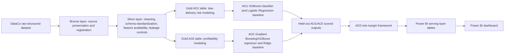

# Figure 1. Medallion and Project Workflow Architecture

Source artifacts: `docs/medallion_structure.md`, `docs/project_orchestrator.md`, `report/final_capstone_report_final_markdown.md`.

Use this Mermaid source to render the final report architecture figure.

Final report caption suggestion:

Figure 1. Medallion and project workflow architecture from DataCo source data through Bronze, Silver, Gold, AO1/AO2 modeling, AO3 risk-margin prioritization, and the Power BI serving layer.

PNG status: not generated in this task. The Mermaid source can be rendered later in Markdown, Mermaid CLI, VS Code, or another approved report-production tool. No model, Databricks, or dashboard artifact was regenerated.
